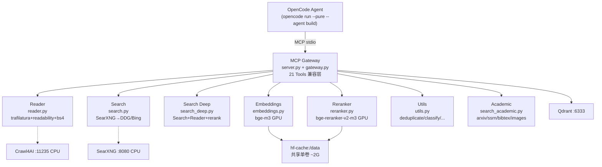

# jina-local — AGENTS.md

> 系统全局本地化替代 `jina.ai` 的 Reader / Search / Reranker / Embeddings，供所有 OpenCode Agent 通过 MCP 统一调用 — 零余额、离线可用、成本 0。

## 1 项目简介

- 目标：`jina.ai` 20+ 云端能力本地化（ Reader / Search / Deep / Embeddings / Reranker / Utils 7 + Academic/Images ），接口签名兼容，原 `jina_*` / `firecrawl_*` 无感迁移。
- 技术栈：`trafilatura+readability-lxml+bs4` 双抽取、`SearXNG→DuckDuckGo/Bing` 聚合、`BAAI/bge-m3` + `bge-reranker-v2-m3` (`float16` TEI 120-1.9)、`FastMCP stdio`、`Qdrant`、`hf-cache` 共享卷、`/tmp/opencode` 缓存。
- 成果：21 工具全兼容、5 维度雷达本地 9.74/10 vs jina 3.6/10、成功率 134/134 100% vs 20/127、92 测试通过、RTX 5070 12GB 常驻 ~5GB。

## 2 全局路径约束（必读）

- **固定部署 `~/jina-local` (`/home/cc/jina-local`)**，非任意 git worktree / 临时目录。所有 Agent、MCP 配置、docker 均以该路径为准，全局唯一可复用。
- 禁止在 `asset-workflow` 等业务仓库 worktree 下创建 `jina-local`（随 worktree 删除丢失）。
- 运行配置在仓库内 `.env`（模板 `.env.example`），不依赖固定部署绝对路径；MCP 全局配置 `~/.config/opencode/opencode.json` 由 `scripts/setup_global_mcp.py` 写入。
- 缓存统一 `/tmp/opencode/jina-local`（sha256 键，>7d / >10G 按 mtime 清最旧，保留 100 + `gpu-stats.json`）。

## 3 快速开始 3 步（与 README 一致）

前置：Docker Compose v2 + NVIDIA Container Toolkit（驱动 ≥595.84 已验 `nvidia-smi`）、Python ≥3.11、无 GPU 自动回退 CPU（hash/cosine fallback，bench 仍 PASS）。

**步骤 1 — 获取代码与环境**

```bash
git clone <repo-url> ~/jina-local
cd ~/jina-local
cp .env.example .env   # 按需编辑：模型/端口/懒加载（MODEL_DTYPE=float16 / JINA_LOCAL_LAZY_LOAD=1 / CACHE_DIR=/tmp/opencode/jina-local）
cat .env
```

**步骤 2 — 一键拉起推理栈**

```bash
docker compose up -d                          # 仅核心：embeddings+reranker+qdrant（省 1G+）
docker compose --profile full up -d           # 全量：含 reader/search（crawl4ai/searxng）
docker compose ps
curl http://localhost:3001/health             # embeddings TEI :80→3001
curl http://localhost:3002/health             # reranker TEI :80→3002
python -m pytest tests/ -q                    # 92 passed 预期
```

**步骤 3 — 配置 MCP（多 Agent 通用，一键接入）**

```bash
python scripts/setup_mcp.py --agent all       # 一键写入全部 Agent（opencode/claude/codex/openclaw/hermes）+ 通用 mcp.json，幂等
python scripts/setup_mcp.py --agent opencode  # 仅 opencode → ~/.config/opencode/opencode.json
python scripts/setup_global_mcp.py            # 兼容旧入口（仅 opencode）
# 手动等价 opencode：{ "mcp": { "jina-local": { "type":"local", "command":["python3","/home/cc/jina-local/mcp-gateway/src/server.py"], "enabled":true } } }
# 通用 mcp.json：{ "mcpServers": { "jina-local": { "command":"python3", "args":["/home/cc/jina-local/mcp-gateway/src/server.py"], "env":{} } } }
# 多传输：python3 /home/cc/jina-local/mcp-gateway/src/server.py --transport stdio|sse|http --host 0.0.0.0 --port 3000
python -m pytest tests/test_mcp_compatibility.py tests/test_mcp_global.py tests/test_mcp_universal.py -v
```

切换完成：原 `jina_*` / `firecrawl_*` 调用无需改代码，网关保持兼容签名。

### 3.1 多 Agent 通用（Claude Code/OpenClaw/Hermes/Codex/Opencode）

> **路径固定 `~/jina-local`（`/home/cc/jina-local`），多传输 `stdio / sse / http` 通用。** 通用模板 `mcp.json`（`mcpServers.jina-local` → `python3 /home/cc/jina-local/mcp-gateway/src/server.py`）为各 Agent 复制源，`python scripts/setup_mcp.py --agent all` 幂等写入。

- **通用 `mcp.json`（项目根）：** `{ "mcpServers": { "jina-local": { "command":"python3", "args":["/home/cc/jina-local/mcp-gateway/src/server.py"], "env":{} } } }`，供 Claude/Codex/OpenClaw/Hermes 直接复制。
- **Claude Code：** `claude mcp add jina-local -- python3 /home/cc/jina-local/mcp-gateway/src/server.py` 或 `~/.config/claude/mcp.json`；一键 `python scripts/setup_mcp.py --agent claude`
- **Codex：** `~/.codex/config.toml` → `[mcp_servers.jina-local] command="python3" args=["/home/cc/jina-local/mcp-gateway/src/server.py"]` 或 `~/.config/codex/mcp.json`；`codex mcp add` 亦可；一键 `python scripts/setup_mcp.py --agent codex`
- **OpenClaw/Hermes：** `cp /home/cc/jina-local/mcp.json ~/.config/openclaw/mcp.json` / `~/.config/hermes/mcp.json`；一键 `python scripts/setup_mcp.py --agent openclaw` / `hermes`
- **Opencode：** `python scripts/setup_mcp.py --agent opencode` 或 `all` → `~/.config/opencode/opencode.json` 的 `mcp.jina-local`（`type: local`）；兼容旧 `python scripts/setup_global_mcp.py`
- **多传输：** `server.py --transport {stdio,sse,http,streamable-http} --host 0.0.0.0 --port 3000`（`--help` 含 `stdio/sse/http`），默认 `stdio`；`http` 为 `streamable-http` 别名；详见 `README.md#多 Agent 接入`。

## 4 架构简图



数据流：Agent tool call → `server.py:FastMCP` → `gateway.py` 路由 → CPU(缓存/聚合) / GPU(TEI `float16`+`max-batch-tokens 16384`+`max-concurrent-requests 64`) → 共享 `hf-cache` / `qdrant-storage` / `/tmp/opencode`。详见 `README.md#架构` 与 `docs/gpu-optimization.md`。

## 5 开发规范（所有 Agent 必遵守）

1. **TDD 必须先 FAIL**：先在 `tests/` 写契约/扩展测试（对齐 jina 返回格式），`python -m pytest` 见 FAIL，再实现 `mcp-gateway/src/*.py`，最后 `bench_*` 验证 5 维度不回归。
2. **subagent 协作**：测试代码直接写 `./tests/` 下；发布 subagent 后可发动 monitor 等其结束再回主框，无需终端等待；模块化、关注点分离，已有库优先（`trafilatura`/`sentence-transformers`/`mcp` 等），查文档后再定是否新增依赖。
3. **执行约束**：所有 Agent 用 `opencode run --pure --agent build`（裸 `opencode run` 会随机掉流）；**禁止给 subagent 加 timeout 限制**，等待其自然结束。
4. **输出限制**：Bash 执行时限制输出 — 搜索结果 `head` ≤100 行、日志 `tail` ≤200 行、大文件不 `cat` 优先 `Read offset/limit`、`git diff` 先 `--stat`、`find/rg` 限目录/类型、大结果先落 `/tmp` 再摘要。
5. **禁止 AI 署名**：commit / PR / 文本中删除 `Co-Authored-By`、 `🤖 Generated with ...`、`This PR was generated by ...`、Claude/Anthropic/OpenAI 等品牌署名（配置项 `includeCoAuthorInCommits:false` 可能不生效，需手动删）。
6. **注释**：不加无意义注释、越短越好，不写历史修改记录。
7. **增量演进**：按「最小可用 → 逐层加能力」演进，不为过渡做兼容层/迁移；选成熟库、复用项目已有依赖；架构决策面向长期。

## 6 目录说明

```text
~/jina-local/
├── AGENTS.md / CLAUDE.md          # 本规范（CLAUDE.md 参见 AGENTS.md）
├── README.md                      # 快速开始/架构/替代表/性能/显存空间/FAQ
├── .env / .env.example            # 模型/端口/懒加载/缓存（JINA_LOCAL_LAZY_LOAD=1 默认）
├── docker-compose.yml             # 5 服务：embeddings/reranker/reader/search/qdrant，共享 hf-cache，profiles 按需
├── mcp-gateway/
│   ├── pyproject.toml
│   └── src/
│       ├── server.py              # FastMCP stdio 入口，21 工具双入口
│       ├── gateway.py             # 统一网关，兼容 jina 签名/别名
│       ├── reader.py / search.py / search_deep.py
│       ├── embeddings.py / reranker.py  # 懒加载+闲置释放+批切片
│       ├── utils.py / search_academic.py
├── tests/                         # 92 tests：test_mcp_* / test_reader* / test_search* / test_reranker* / test_embeddings* / test_bench_full.py / test_bench_levels.py
├── mcp.json                       # 通用 mcpServers 标准配置（任意 Agent 复用）
├── scripts/
│   ├── bench_*.py (7) + bench_full.py  # 5 维度 bench → /tmp/jina-local-bench-*.json → docs/bench-full.md
│   ├── clean_cache.py             # 7d/10G/100 文件清理
│   ├── setup_mcp.py               # 通用写入：opencode/claude/codex/openclaw/hermes mcp 配置（--agent all）
│   └── setup_global_mcp.py        # 兼容旧入口（仅 opencode）
└── docs/
    ├── bench-full.md              # L1-L4 四层总评 + 5 维度雷达 + 21 工具表
    ├── bench-reader.md
    ├── gpu-optimization.md        # 12GB 显存预算/并发/懒加载
    ├── space-optimization.md      # du 实测 4 类大小
    └── images.md                  # 镜像版本/digest/pull_policy
```

## 7 测试与评测（pytest + bench_*）

```bash
# 单测 — 92 passed 预期
python -m pytest tests/ -q
python -m pytest tests/test_bench_levels.py tests/test_bench_full.py -v   # 四层+总评
python -m pytest tests/test_mcp_compatibility.py -v                        # 21 工具签名
python -m pytest tests/test_reader_extended.py tests/test_reranker_extended.py -v

# 懒加载/强制 CPU
JINA_LOCAL_LAZY_LOAD=1 python -m pytest tests/ -q
JINA_LOCAL_USE_GPU=0 python -m pytest tests/ -q

# 评测 — 5 维度（延迟/相关性/成功率/成本/离线）
python scripts/bench_reader.py; python scripts/bench_search.py; python scripts/bench_search_deep.py
python scripts/bench_reranker.py; python scripts/bench_embeddings.py; python scripts/bench_utils.py; python scripts/bench_mcp_global.py
python scripts/bench_full.py
cat /tmp/jina-local-bench-full.json | python -m json.tool
cat docs/bench-full.md

# 四层验证
python -m pytest tests/test_bench_levels.py -v   # L1工具级 L2维度级 L3系统级 L4硬件级

# 空间/缓存
python scripts/clean_cache.py --dry-run
cat /tmp/jina-local-bench-space.json | python -m json.tool
cat docs/space-optimization.md
```

评测体系 L1-L4 见 `docs/bench-full.md#多层次评测体系`：L1 工具级 21 工具逐项、L2 维度级 5 维度雷达、L3 系统级 92 测试+MCP 全兼容、L4 硬件级 GPU 显存/并发+空间占用。`bench_full.py` 闭环：某维度 `NEEDS_OPT/FAIL` 时在 `mcp-gateway/src/*.py` 插 `# TODO(bench-full): …` 并在 `bench-full.md` 记录，5 维度全 PASS 时无 TODO（当前）。

## 8 GPU/空间优化要点

- **显存预算 RTX 5070 12GB**（`docs/gpu-optimization.md`）：embeddings bge-m3 ~2.5G + reranker ~1.5G + overhead ~1G = ~5G 常驻（41%），余 ~7G 可跑 vLLM 8B Q4。
- **量化** `float16`/`half()` ≈50% 节省；**并发** `max-batch-tokens 16384` 切片 + `max-concurrent-requests 64` + `shm_size 1g` >100 QPS；兼容 `runtime:nvidia` + `deploy.resources.reservations.devices`。
- **按需加载**（`JINA_LOCAL_LAZY_LOAD=1` 默认）：`import` 时 `_backend=None`，首次 `embed()/rerank()` 才 `_init_backend()`，闲置 `JINA_LOCAL_IDLE_TIMEOUT=1800` 后 `weakref` + `torch.cuda.empty_cache()` + `gc.collect()` 释放，单模型未用省 50%，全闲置近 0 GPU。验证：`JINA_LOCAL_LAZY_LOAD=1 python -c "import sys;sys.path.insert(0,'mcp-gateway/src');import embeddings;print(embeddings._backend)"`。
- **Reader 去 GPU**：`crawl4ai` 仅 CPU，避免抢占余量。
- **空间**（`docs/space-optimization.md`）：code ~2.5M + image ~2G (TEI 共享) + model ~2G (`hf-cache:/data` 单卷共享) + cache <1G (实测 1.3M)；`docker-compose.yml` `pull_policy:missing` + `profiles` 按需省 1G+；`scripts/clean_cache.py` 7d/10G/100 清理，与 AGENTS.md 第9条 `opencode.db >10G` 一致 — 暂停工作流再清理，禁止运行中清理。

## 9 常见坑

- **路径放错 worktree** → `scripts/setup_global_mcp.py` 告警，务必 `~/jina-local`。
- **裸 `opencode run` 掉流** → 必须 `opencode run --pure --agent build`。
- **给 subagent 加 timeout** → 禁止，等待自然结束。
- **显存 OOM** → `JINA_LOCAL_MAX_BATCH_TOKENS=8192` 或 `JINA_LOCAL_USE_GPU=0`；切勿给 reader 配 GPU。
- **torch 为 +cpu** → `torch.cuda.is_available()==False` 属正常，hash/cosine fallback，bench 仍 PASS，换 `torch==2.8+cu128` 自动启用 GPU。
- **缓存爆盘** → `python scripts/clean_cache.py --dry-run` 预览，`--no-dry-run` 清理；不要在工作流运行中清理 `/tmp/opencode`。
- **云端 402** → 本地 100% 成功率，无余额依赖；`docs/bench-full.md` 可复现对标。
- **提交/推送未经允许** → 无指令不 `git commit/push/pull`；commit 前 `git status/diff/log --oneline -10` 核对，删 AI 署名。

> 新 Agent 入口：读本文件 → `README.md#快速开始3步` → `python -m pytest tests/ -q` → `docs/bench-full.md` 看 L1-L4 → 按 TDD 改 `tests/` + `mcp-gateway/src/` → `scripts/bench_full.py` 回归。
