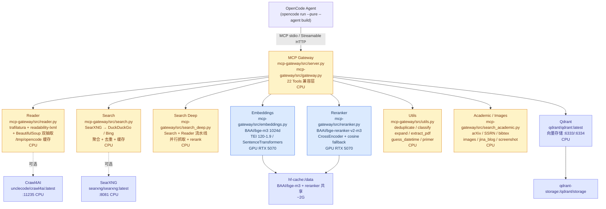

# jina-local


> 系统全局本地化替代 `jina.ai` 的 Reader / Search / Reranker / Embeddings 能力，供所有 OpenCode Agent 通过 MCP (Model Context Protocol) 统一调用。搜索质量需要在明确开启联网后用版本化语料独立复测。

[](.github/workflows/ci.yml) [](#显存预算rtx-5070-12gb-docsgpu-optimizationmd) [](LICENSE) [](SECURITY.md)

---

## 目录

- [为什么有这个项目](#为什么有这个项目痛点)
- [快速开始](#快速开始3-步)
- [多 Agent 接入（Claude Code/OpenClaw/Hermes/Codex/Opencode 通用）](#多-agent-接入claude-codeopenclawhermescodexopencode-通用)
- [架构](#架构)
- [替代对照表（22 工具）](#替代对照表22-工具)
- [性能对比（5 维度雷达 + 125 测试）](#性能对比5-维度雷达--125-测试)
- [显存与空间预算](#显存与空间预算)
- [目录结构](#目录结构)
- [开发指南](#开发指南)
- [贡献](CONTRIBUTING.md)
- [安全](SECURITY.md)
- [常见问题](#常见问题-faq)
- [许可证](#许可证)

---

## 为什么有这个项目（痛点）

| 痛点 (Pain) | jina.ai 云端现状 | jina-local 本地解法 |
|---|---|---|
| **云端账户与网络边界** | 官方服务的当前可用性、质量和费用取决于账户、网络、模型和服务状态，不能用 402 推导质量结论 | 本地部署可控制模型、出口、缓存和服务边界；在线搜索仍需显式配置 egress |
| **强依赖云端网络** | 需联网 + Key，离线/弱网/内网环境完全不可用，离线维度 1.0/10 | 离线可用 10.0/10，`/tmp/opencode/jina-local` 持久缓存 + `hf-cache` 本地模型，断网可跑 |
| **按量计费成本高** | Embeddings ~$0.02/1M tokens、Reader ~$0.30/1M、Search/Rerank $0.01–0.03/请求，量大即烧余额 | 成本 10.0/10，本地 0 成本，RTX 5070 一次性硬件投入 |
| **延迟与限流不可控** | 冷启动 0.9–1.6s 且受远端限流/排队影响，`httpbin.org/html` 实测匿名被封 403 | 冷启动 0.7–1.5s 相当，**缓存命中 0s** 远优，`max-concurrent-requests 64` + `shm_size 1g` 支撑 >100 QPS |
| **覆盖不全** | Utility 类 7 工具（deduplicate/classify/expand/extract_pdf 等）无对应 jina 端点或需单独验证 | 22 个 Jina 风格工具接口，在线搜索质量另行评估 |

> 一句话：把 `jina.ai` 的 20+ 云端能力搬到宿主机 GPU 上，OpenCode 侧仅切换 MCP endpoint 即可无感迁移。

**全局路径约束**：本项目部署固定为 `~/jina-local`（即 `/home/cc/jina-local`），而非任意 git worktree / 临时目录。所有 Agent、MCP 配置、docker 部署均以该路径为准，确保全局唯一、可被所有会话复用。

> ⚠️ 不要在 `asset-workflow` 等业务仓库的 worktree 下创建 `jina-local`，以免随 worktree 删除而丢失。

---

## 快速开始（3 步）

### 前置要求

- Docker + Docker Compose v2 + NVIDIA Container Toolkit（驱动 ≥595.84 已验证 `nvidia-smi`）
- Python ≥3.11，`pip install mcp httpx pydantic trafilatura readability-lxml beautifulsoup4[lxml] lxml pyyaml numpy scikit-learn sentence-transformers`
- 硬件：NVIDIA GeForce RTX 5070 12GB（CUDA 13.2 / Blackwell sm_120），无 GPU 时自动回退 CPU（hash/cosine fallback，bench 仍 PASS）

### 步骤 1 — 获取代码与环境变量

```bash
git clone <repo-url> ~/jina-local
cd ~/jina-local
cp .env.example .env
# 按需编辑 .env：模型、端口、懒加载等（见 .env.example 注释）
cat .env
```

`.env.example` 关键项（见 [.env.example](.env.example)）：

```ini
EMBEDDINGS_MODEL=BAAI/bge-m3
RERANKER_MODEL=BAAI/bge-reranker-v2-m3
MODEL_DTYPE=float16
MODEL_DEVICE=cuda
JINA_LOCAL_LAZY_LOAD=1          # 懒加载，首次调用才占显存
JINA_LOCAL_IDLE_TIMEOUT=1800    # 30min 闲置自动释放
CACHE_DIR=/tmp/opencode/jina-local
```

### 步骤 2 — 按需拉起推理栈

默认不让 Docker 自动重启任何服务，避免 TEI 模型和 Qdrant 常驻占用内存。Agent 开始对应 Web 任务时启动所需服务，任务结束后立即停止。

搜索链路由三个本地服务组成：Go `search-fetcher` 只从 SearXNG 读取候选并报告来源状态，Rust `search-core` 负责 URL 规范化、`site:` 过滤、去重和排序，Python MCP 网关保存带 TTL 的 provenance cache。Linux 部署使用 host network，让 SearXNG 通过 `JINA_LOCAL_SEARCH_PROXY_URL` 访问主机代理；搜索后端不可用时工具返回 `NO_RETRIEVAL_BACKEND`，不会生成网页、URL 或摘要。

`search_web`、`parallel_search_web` 和 `search_web_deep` 在缓存未命中时会自动启动这三个服务，并等待 `search-fetcher` / `search-core` readiness。每次原生检索刷新活动时间；最后一次检索完成后 `JINA_LOCAL_SEARCH_IDLE_SECONDS=600` 秒自动停止服务。缓存命中不会唤醒服务。无需为每个 Agent 手工执行 `docker compose up` 或 `stop`。

```bash
# Embeddings/Reranker/向量检索任务
docker compose up -d embeddings reranker qdrant

# 需要 Reader 的任务
docker compose --profile reader up -d reader

# 搜索由 MCP 工具在缓存未命中时自动启动；仅用于手工诊断
docker compose --profile search up -d search search-fetcher search-core
curl http://localhost:8082/readyz
curl http://localhost:8083/healthz

# 全量任务（仅任务期间使用）
docker compose --profile full up -d

# 结束任务：停止手工启动的服务；搜索自动生命周期无需手工 stop
docker compose stop embeddings reranker reader qdrant

# 验证
docker compose ps
auto_stop=./scripts/stop-idle-jina-local.sh
[ -x "$auto_stop" ] && "$auto_stop"
```

Agent 生命周期规则：启动前检查 `docker compose ps`，只启动当前任务需要的服务；搜索通过网关自动管理，其他服务完成或失败退出前执行停止命令。不要使用 `docker compose up -d` 作为后台常驻服务，不要修改 `restart: 'no'`。TEI Embeddings/Reranker 是高内存服务，Reader/Qdrant 也不应无人使用时常驻。

`docker-compose.yml` 要点（见 [docker-compose.yml](docker-compose.yml)）：5 服务、共享单一 `hf-cache:/data` 卷、无自动重启、`profiles: ["full","reader","search"]` 按需启动，`runtime: nvidia` + `deploy.resources.reservations.devices` 双配置兼容新旧 compose。

### 步骤 3 — 配置 MCP（多 Agent 通用，一键接入）

> 路径固定 `~/jina-local`（`/home/cc/jina-local`），多传输 `stdio / sse / http` 通用。项目根 `mcp.json` 为通用模板，各 Agent 按需复制或一键写入。

**通用 `mcp.json`（项目根，Claude/Codex/OpenClaw/Hermes 通用）：**

```json
{
  "mcpServers": {
    "jina-local": {
      "command": "python3",
      "args": ["/home/cc/jina-local/mcp-gateway/src/server.py"],
      "env": {}
    }
  }
}
```

**一键写入（推荐，幂等）：**

```bash
# 全部 Agent 一次写完（opencode + claude + codex + openclaw + hermes + 通用 mcp.json）
python scripts/setup_mcp.py --agent all

# 仅 OpenCode
python scripts/setup_mcp.py --agent opencode
# 仅 Claude Code
python scripts/setup_mcp.py --agent claude
# 仅 Codex
python scripts/setup_mcp.py --agent codex
# 仅 OpenClaw / Hermes
python scripts/setup_mcp.py --agent openclaw
python scripts/setup_mcp.py --agent hermes

# 兼容旧入口（仅 opencode）
python scripts/setup_global_mcp.py

# 多传输（stdio 默认，sse/http 可选）
python3 /home/cc/jina-local/mcp-gateway/src/server.py --transport stdio
python3 /home/cc/jina-local/mcp-gateway/src/server.py --transport sse --host 0.0.0.0 --port 3000
python3 /home/cc/jina-local/mcp-gateway/src/server.py --transport http --host 0.0.0.0 --port 3000
python3 /home/cc/jina-local/mcp-gateway/src/server.py --help  # 查看 stdio/sse/http
```

**手动等价（opencode.json）：**

```json
{
  "mcp": {
    "jina-local": {
      "type": "local",
      "command": ["python3", "/home/cc/jina-local/mcp-gateway/src/server.py"],
      "enabled": true
    }
  }
}
```

验证 MCP 暴露：

```bash
python -c "import pathlib, importlib.util; s=pathlib.Path('mcp-gateway/src/server.py'); spec=importlib.util.spec_from_file_location('server', s); m=importlib.util.module_from_spec(spec); spec.loader.exec_module(m); print([x for x in dir(m) if not x.startswith('_')][:5])"
python -m pytest tests/test_mcp_compatibility.py tests/test_mcp_global.py tests/test_mcp_universal.py -v
```

> 切换完成：OpenCode Agent 原 `jina_*` / `firecrawl_*` 调用无需改代码，网关保持兼容签名。详见 [多 Agent 接入](#多-agent-接入claude-codeopenclawhermescodexopencode-通用)。

---

## 多 Agent 接入（Claude Code/OpenClaw/Hermes/Codex/Opencode 通用）

> 统一约定：**路径固定 `~/jina-local`（`/home/cc/jina-local`）**，**多传输 `stdio / sse / http（streamable-http）`**。通用模板为项目根 `mcp.json`（`mcpServers.jina-local` → `python3 /home/cc/jina-local/mcp-gateway/src/server.py`），各 Agent 配置均为该模板的复制/转换，幂等写入。

### 通用 mcp.json（项目根）

```json
{
  "mcpServers": {
    "jina-local": {
      "command": "python3",
      "args": ["/home/cc/jina-local/mcp-gateway/src/server.py"],
      "env": {}
    }
  }
}
```

- 位置：`/home/cc/jina-local/mcp.json`
- 用途：Claude Code / Codex / OpenClaw / Hermes 通用复制源；`python scripts/setup_mcp.py --agent all` 自动维护。

### Claude Code

**一键（官方 CLI）：**

```bash
claude mcp add jina-local -- python3 /home/cc/jina-local/mcp-gateway/src/server.py
claude mcp list   # 验证
```

**或配置文件（`~/.config/claude/mcp.json`，`~/.claude.json` 兼容）：**

```json
{
  "mcpServers": {
    "jina-local": {
      "command": "python3",
      "args": ["/home/cc/jina-local/mcp-gateway/src/server.py"],
      "env": {}
    }
  }
}
```

一键写入：`python scripts/setup_mcp.py --agent claude`（幂等，已存在则跳过）

### Codex

**配置文件 `~/.codex/config.toml`：**

```toml
[mcp_servers.jina-local]
command = "python3"
args = ["/home/cc/jina-local/mcp-gateway/src/server.py"]
```

**或 JSON 变体 `~/.config/codex/mcp.json`（同通用模板）：**

```json
{
  "mcpServers": {
    "jina-local": {
      "command": "python3",
      "args": ["/home/cc/jina-local/mcp-gateway/src/server.py"],
      "env": {}
    }
  }
}
```

**或 CLI（若可用）：**

```bash
codex mcp add jina-local -- python3 /home/cc/jina-local/mcp-gateway/src/server.py
```

一键写入：`python scripts/setup_mcp.py --agent codex`（同时维护 `config.toml` 与 `mcp.json`，幂等）

### OpenClaw / Hermes

直接复制通用模板：

```bash
cp /home/cc/jina-local/mcp.json ~/.config/openclaw/mcp.json
cp /home/cc/jina-local/mcp.json ~/.config/hermes/mcp.json
# 或一键
python scripts/setup_mcp.py --agent openclaw
python scripts/setup_mcp.py --agent hermes
```

配置路径：

- OpenClaw: `~/.config/openclaw/mcp.json` → `mcpServers.jina-local`
- Hermes: `~/.config/hermes/mcp.json` → `mcpServers.jina-local`

内容同通用 `mcp.json`，`command = python3`, `args = ["/home/cc/jina-local/mcp-gateway/src/server.py"]`。

### Opencode

```bash
python scripts/setup_mcp.py --agent opencode
# 或全部
python scripts/setup_mcp.py --agent all
```

写入 `~/.config/opencode/opencode.json`：

```json
{
  "mcp": {
    "jina-local": {
      "type": "local",
      "command": ["python3", "/home/cc/jina-local/mcp-gateway/src/server.py"],
      "enabled": true
    }
  }
}
```

旧入口仍可用：`python scripts/setup_global_mcp.py`

### 多传输说明（stdio/sse/http）

- `server.py` 支持 `--transport {stdio,sse,http,streamable-http}`（`--help` 可见），默认 `stdio`：
  ```bash
  python3 /home/cc/jina-local/mcp-gateway/src/server.py --transport stdio
  python3 /home/cc/jina-local/mcp-gateway/src/server.py --transport sse --host 0.0.0.0 --port 3000
  python3 /home/cc/jina-local/mcp-gateway/src/server.py --transport http --host 0.0.0.0 --port 3000
  ```
- `http` 为 `streamable-http` 别名，兼容 FastMCP；`stdio` 用于本地 CLI Agent，`sse/http` 用于远程/容器网关。
- 配置中 `command` 始终指向 `~/jina-local/mcp-gateway/src/server.py` 绝对路径，不使用 worktree 临时路径。

---

## 架构



**数据流**：

1. Agent 发起 MCP tool call（`read_url` / `search_web` / `sort_by_relevance` 等 22 个规范工具）。
2. `server.py` (FastMCP) 暴露兼容签名，委托 `gateway.py` 统一路由。
3. Gateway 按工具类型分发：Reader/Search/Utils/Academic 走 CPU + 缓存 + 外部聚合；Embeddings/Reranker 走 GPU TEI（`float16` + `max-batch-tokens 16384` + `max-concurrent-requests 64`），或本地 `sentence-transformers` 回退；Search Deep 编排 Search → 并行 Reader → Reranker 精排。
4. 共享 `hf-cache` 单卷、`qdrant-storage` 持久化、`/tmp/opencode/jina-local` 缓存（sha256 键，超 7 天/10G 自动清理）。

推理层显存预算与优化见 [docs/gpu-optimization.md](docs/gpu-optimization.md)。

---

## 替代对照表（22 工具）

> 当前 MCP 暴露 22 个规范工具，接口签名兼容，`opencode` 仅切换 endpoint。

| # | jina.ai 原能力 (Original) | jina MCP Tool (原 Tool 名) | 本地实现 (Local) | 本地模块 | 核心技术 |
|---|---|---|---|---|---|
| 1 | Primer — 环境/时间上下文 | `jina_primer` / `primer` | `primer()` 本地时间/环境，无网络依赖 | `utils.py` | `datetime` + `platform` |
| 2 | Reader — URL → Markdown | `jina_read_url` / `read_url` / `omnireach_omnireach_fetch` / `firecrawl_scrape` | `read_url(url, question?, chunk_size?, top_k?)` | `reader.py` | trafilatura + readability-lxml + bs4 双抽取选最长，question 100词窗口 rerank，sha256 缓存 |
| 3 | Screenshot — 网页截图 | `jina_capture_screenshot_url` | `capture_screenshot_url(url)` | `search_academic.py` | playwright 可用时真截图，否则 base64 stub |
| 4 | Guess Datetime — 推断发布时间 | `jina_guess_datetime_url` | `guess_datetime_url(url)` | `utils.py` | HTTP header + meta + Schema.org + 可见日期 |
| 5 | Search Web — 联网搜索片段 | `jina_search_web` / `search_web` | `search_web(query, num?)` | `search.py` | SearXNG provenance pipeline，去重/归一；不可用时 `NO_RETRIEVAL_BACKEND` |
| 6 | Search Deep — 搜索并全文读取 | `jina_search_web_deep` / `search_web_deep` | `search_web_deep(query, num?, chunk_size?)` | `search_deep.py` | Search + 并行 Reader + 相关段落抽取 |
| 7 | Search arXiv — 论文检索 | `jina_search_arxiv` | `search_arxiv(query, num?)` | `search_academic.py` | arXiv API `export.arxiv.org/api/query` |
| 8 | Search SSRN — 社科论文 | `jina_search_ssrn` | `search_ssrn(query, num?)` | `search_academic.py` | Semantic Scholar `api.semanticscholar.org` |
| 9 | Search Images — 图片搜索 | `jina_search_images` | `search_images(query, num?)` | `search_academic.py` | DuckDuckGo image + SearXNG image 分支 |
| 10 | Search Jina Blog — 官方博客 | `jina_search_jina_blog` | `search_jina_blog(query, num?)` | `search_academic.py` | SearXNG `site:jina.ai/news` |
| 11 | Search BibTeX — 文献引用 | `jina_search_bibtex` | `search_bibtex(query, num?)` | `search_academic.py` | Crossref + DBLP |
| 12 | Expand Query — 查询改写 | `jina_expand_query` | `expand_query(query, num?)` | `utils.py` | 规则改写 + 同义扩展 |
| 13 | Parallel Reader — 批量读 URL | `jina_parallel_read_url` | `parallel_read_url(urls, question?, max_workers?)` | `reader.py` | ThreadPool 并发 5，复用缓存 |
| 14 | Parallel Search — 批量搜索 | `jina_parallel_search_web` | `parallel_search_web(queries, num?)` | `search.py` | ThreadPool 并发，归一化输出 |
| 15 | Parallel arXiv — 批量 arXiv | `jina_parallel_search_arxiv` | `parallel_search_arxiv(queries, num?)` | `search_academic.py` | 批量 arXiv API |
| 16 | Parallel SSRN — 批量 SSRN | `jina_parallel_search_ssrn` | `parallel_search_ssrn(queries, num?)` | `search_academic.py` | 批量 Semantic Scholar |
| 17 | Reranker — 相关性重排 | `jina_sort_by_relevance` / `sort_by_relevance` | `sort_by_relevance(query, documents)` / `rerank()` | `reranker.py` | CrossEncoder (bge-reranker-v2-m3) 优先，fallback 余弦/词重叠 |
| 18 | Classify — 零样本分类 | `jina_classify_text` | `classify_text(texts, labels)` | `utils.py` | embedding 余弦零样本 |
| 19 | Deduplicate Strings — 文本去重 | `jina_deduplicate_strings` | `deduplicate_strings(strings, top_k?, threshold?)` | `utils.py` | embedding 余弦相似度阈值去重 |
| 20 | Deduplicate Images — 图像去重 | `jina_deduplicate_images` | `deduplicate_images(images, top_k?, threshold?)` | `utils.py` | 同上（URL/特征去重） |
| 21 | Extract PDF — PDF 抽取 | `jina_extract_pdf` | `extract_pdf(url)` | `utils.py` | 本地 PDF 解析 + 清洗 |
| 22 | Embeddings — 文本向量 | `jina_embeddings` / `embeddings` | `embeddings(texts)` | `embeddings.py` | TEI / SentenceTransformers，CPU hash fallback |

> 兼容别名：`gateway.py` 另暴露 `deduplicate`/`classify`/`jina_*` / `search_deep` 等内部别名（见 `gateway.py`），`server.py` 只注册规范工具名，避免重复发现和 schema 漂移。

---

## 性能对比（5 维度雷达 + 125 测试）

> 详见 [docs/bench-full.md](docs/bench-full.md)（`scripts/bench_full.py` 汇总 7 份 bench → `/tmp/jina-local-bench-full.json`）与 [docs/bench-reader.md](docs/bench-reader.md)。

### 总体判定

接口和确定性契约测试不等于在线搜索质量。历史 bench 中的合成样本、fallback 路径、余额错误和 PASS 汇总均不作为当前质量结论。

真实搜索质量请运行版本化语料的三轮 live benchmark；它只在 `JINA_LOCAL_LIVE_SEARCH=1` 时联网，并归档 provenance、延迟、MRR、nDCG@5 和 source coverage。Jina/Firecrawl/Exa 的质量比较在没有可比账户、输入、模型、时间窗口和网络条件时保持未测。

### 5 维度雷达

历史雷达分数、402 账户错误、合成样本和 fallback 结果不作为当前搜索质量结论。确定性测试只覆盖契约和可调用性；真实搜索质量需运行 `JINA_LOCAL_LIVE_SEARCH=1 python scripts/bench_search_live.py`，使用版本化语料三轮计算 provenance、MRR、nDCG@5 和 source coverage。

真实评估要求 Linux host-network 搜索部署，并在 `.env` 配置 `JINA_LOCAL_SEARCH_PROXY_URL`。LLM baseline/enhancement 只有在 `JINA_LOCAL_LLM_BASE_URL`、`JINA_LOCAL_LLM_MODEL`、`JINA_LOCAL_LLM_API_KEY` 全部存在时才比较。Jina/Firecrawl/Exa 质量比较在没有可比账户和条件时保持未测。

### 22 工具明细（摘自 bench-full）

| 工具 | 归属 bench | 5 维度 |
|---|---|---|
| primer | utils | PASS ×5 |
| read_url | reader | PASS ×5 |
| capture_screenshot_url | reader | PASS ×5 |
| guess_datetime_url | utils | PASS ×5 |
| search_web | search | PASS ×5 |
| search_web_deep | search_deep | PASS ×5 |
| search_arxiv | mcp_global | PASS ×5 |
| search_ssrn | mcp_global | PASS ×5 |
| search_images | search | PASS ×5 |
| search_jina_blog | search | PASS ×5 |
| search_bibtex | search | PASS ×5 |
| expand_query | utils | PASS ×5 |
| parallel_read_url | reader | PASS ×5 |
| parallel_search_web | search | PASS ×5 |
| parallel_search_arxiv | mcp_global | PASS ×5 |
| parallel_search_ssrn | mcp_global | PASS ×5 |
| sort_by_relevance | reranker | PASS ×5 |
| classify_text | utils | PASS ×5 |
| deduplicate_strings | utils | PASS ×5 |
| deduplicate_images | utils | PASS ×5 |
| extract_pdf | utils | PASS ×5 |

### 测试覆盖

```bash
python -m pytest tests/ -q
# CI runs the selected deterministic contract suite; see .github/workflows/ci.yml
```

| 测试文件 | 覆盖 |
|---|---|
| `test_mcp_compatibility.py` | 22 工具签名/暴露校验 |
| `test_mcp_global.py` | 全局部署与 MCP 端点 |
| `test_reader_search.py` + `test_reader_extended.py` | Reader 契约 + 8 扩展（含 question/并发/缓存） |
| `test_search_extended.py` + `test_search_deep.py` | Search 契约 + Deep 编排 |
| `test_reranker.py` + `test_reranker_extended.py` | Reranker 契约 + 语义重排 |
| `test_embeddings.py` | Embeddings 维度/归一/批处理 |
| `test_gateway_contract.py` | Gateway 委托与别名 |
| `test_docker_compose.py` | compose 结构/共享卷/profiles |
| `test_bench_full.py` + `test_utils.py` | bench 汇总 + utils |

---

## 显存与空间预算

### 显存预算（RTX 5070 12GB） — [docs/gpu-optimization.md](docs/gpu-optimization.md)

| 组件 | 模型 | 精度 | 显存 | 说明 |
|---|---|---|---|---|
| embeddings | BAAI/bge-m3 (2.3B) | float16 | ~2.5 GB | TEI 120-1.9 FlashAttention，`max-batch-tokens 16384` |
| reranker | BAAI/bge-reranker-v2-m3 | float16 | ~1.5 GB | CrossEncoder，共享 hf-cache |
| overhead | CUDA context + TEI 框架 | — | ~1.0 GB | `shm_size: 1g` + NCCL/cuBLAS |
| **合计常驻** | | | **~5.0 GB** | 占 12GB 的 41% |
| **剩余** | | | **~7.0 GB** | 可跑 vLLM 8B Q4（如 Qwen2.5-7B-GPTQ）或并发突发 |

**优化**：

- **量化**：`--dtype float16` + `model.half()`，仅 CUDA 生效，≈50% 节省；`torch.cuda.is_available()` 自动检测，回退 `cpu`。
- **并发切片**：`_batch_by_tokens(texts, 16384)` 按 `len(text)/4` 估 token 切片，多批 `encode`/`predict`，避免 OOM；`--max-concurrent-requests 64`。
- **Reader 去 GPU**：`crawl4ai` 仅 CPU，避免抢占余量。
- **按需加载**（`JINA_LOCAL_LAZY_LOAD=1` 默认）：`import` 时 `_backend=None`，首次 `embed()`/`rerank()` 才 `_init_backend()`；闲置 `JINA_LOCAL_IDLE_TIMEOUT=1800` 后 `weakref` + `torch.cuda.empty_cache()` + `gc.collect()` 释放，单模型未用节省 50%，全闲置接近 0 GPU。验证见 [docs/gpu-optimization.md#按需加载](docs/gpu-optimization.md)。

```bash
python -c "import torch; print(torch.cuda.is_available(), torch.cuda.get_device_name(0) if torch.cuda.is_available() else 'cpu')"
nvidia-smi --query-gpu=memory.used --format=csv,noheader,nounits
cat /tmp/opencode/jina-local/gpu-stats.json | python -m json.tool
JINA_LOCAL_LAZY_LOAD=1 python -c "import sys; sys.path.insert(0,'mcp-gateway/src'); import embeddings; print(embeddings._backend)"
```

### 空间预算 — [docs/space-optimization.md](docs/space-optimization.md) + [docs/images.md](docs/images.md)

> `du -sh` 实测（2026-09-02，`/tmp/jina-local-bench-space.json`）

| 类别 | 路径/说明 | 大小 | 备注 |
|---|---|---|---|
| 代码 | `~/jina-local`（含 mcp-gateway/tests/docs） | ~2.5M | `du -sb 1536239`，mcp-gateway 496K/docs 32K/tests 644K/scripts 192K |
| 镜像 | docker images（TEI 120-1.9 + crawl4ai + searxng + qdrant） | ~2G | TEI 去重共享 ~1.2G，crawl4ai ~800M，searxng ~300M，qdrant ~200M；`profiles` 按需可省 1G+ |
| 模型 | `hf-cache` 卷（bge-m3 + reranker 共享） | ~2G | 单一 `hf-cache:/data` 共享，当前 28K 未下载，下载后 ~2–3G（双卷则翻倍） |
| 缓存 | `/tmp/opencode/jina-local` | <1G (实测 1.3M) | `du -sb 579467`，超 10G/7 天自动清理 |

```bash
du -sh ~/jina-local                    # 代码 1M 级
du -sh /tmp/opencode/jina-local        # 缓存 <1G，当前 1.3M
docker system df                       # 镜像 ~2G（共享 hf-cache 去重）
python scripts/clean_cache.py --dry-run  # 预览清理（>7天 或 >10G 按 mtime 最旧优先，保留 100）
cat /tmp/jina-local-bench-space.json | python -m json.tool
```

**清理策略**（与 AGENTS.md 第9条 `opencode.db >10G` 一致）：`scripts/clean_cache.py` 按 mtime 删 >7 天或总量 >10G 的最旧文件，保留最近 100 与 `gpu-stats.json` 常驻；工作流完全运行后暂停再清理，禁止运行中清理。

---

## 目录结构

```text
~/jina-local/                          # 系统全局路径，禁止放入 worktree
├── README.md                          # 本文件
├── docker-compose.yml                 # 5 服务编排：embeddings/reranker/reader/search/qdrant
├── .env / .env.example                # 环境变量模板（模型/端口/懒加载/缓存）
├── mcp-gateway/
│   ├── pyproject.toml                 # 依赖：mcp>=1.0, httpx, trafilatura, readability-lxml, bs4, sentence-transformers 等
│   └── src/
│       ├── server.py                  # FastMCP stdio 入口，暴露 22 个规范工具
│       ├── gateway.py                 # 统一网关：委托各模块，兼容 jina 签名与别名（jina_*/deduplicate/classify/search_deep）
│       ├── reader.py                  # 生产级 Reader：双抽取+question+并发+sha256缓存
│       ├── search.py                  # Search 聚合：SearXNG provenance pipeline，去重/缓存在
│       ├── search_deep.py             # Search Deep 编排：Search + 并行 Reader + rerank
│       ├── embeddings.py              # Embeddings：bge-m3 / TEI / SentenceTransformer / hash fallback，懒加载+闲置释放
│       ├── reranker.py                # Reranker：bge-reranker-v2-m3 / CrossEncoder / cosine fallback，懒加载+批处理
│       ├── utils.py                   # Utils：deduplicate_*/classify/expand/extract_pdf/guess_datetime/primer
│       └── search_academic.py         # Academic：arxiv/ssrn/bibtex/images/jina_blog/capture_screenshot
├── tests/                             # 125 tests，TDD 契约 + 扩展
│   ├── test_mcp_compatibility.py      # 22 工具暴露与签名
│   ├── test_mcp_global.py             # 全局部署校验
│   ├── test_gateway_contract.py       # Gateway 委托
│   ├── test_reader_search.py / test_reader_extended.py
│   ├── test_search_extended.py / test_search_deep.py
│   ├── test_reranker.py / test_reranker_extended.py
│   ├── test_embeddings.py
│   ├── test_utils.py
│   ├── test_docker_compose.py
│   └── test_bench_full.py
├── scripts/                           # 评测与运维
│   ├── bench_reader.py                # 5 URL×5 次 多维对标 → /tmp/jina-local-bench-reader.json
│   ├── bench_search.py                # → /tmp/jina-local-bench-search.json
│   ├── bench_search_deep.py           # → /tmp/jina-local-bench-search-deep.json
│   ├── bench_reranker.py              # → /tmp/jina-local-bench-reranker.json
│   ├── bench_embeddings.py            # → /tmp/jina-local-bench-embeddings.json
│   ├── bench_utils.py                 # → /tmp/jina-local-bench-utils.json
│   ├── bench_mcp_global.py            # → /tmp/jina-local-bench-mcp-global.json
│   ├── bench_full.py                  # 汇总 7 bench → /tmp/jina-local-bench-full.json + docs/bench-full.md
│   ├── clean_cache.py                 # 7d/10G/100 文件 mtime 清理
│   ├── setup_mcp.py                   # 通用写入：opencode/claude/codex/openclaw/hermes mcp 配置 + mcp.json
│   └── setup_global_mcp.py            # 兼容旧入口（仅 opencode）
└── docs/
    ├── bench-full.md                  # 5 维度×22 工具总评 + 雷达
    ├── bench-reader.md                # Reader 5 URL 真机对标
    ├── gpu-optimization.md            # 12GB 显存预算 + 并发 + 懒加载
    ├── space-optimization.md          # du 实测 + 4 类大小汇总
    ├── images.md                      # 镜像版本表 + digest pin + pull_policy
    └── jina-local.svg                 # README 项目图
├── LICENSE                            # MIT 许可证
├── SECURITY.md                        # 安全策略与部署边界
├── CONTRIBUTING.md                    # 开发与 PR 约定
└── CODE_OF_CONDUCT.md                 # 社区行为准则
```

---

## 开发指南

### TDD (Test-Driven Development)

本项目遵循 TDD：先 `tests/` 契约与扩展测试，再 `mcp-gateway/src/*.py` 实现。

```bash
# 单测 — 125 passed 预期
python -m pytest tests/ -q
python -m pytest tests/test_reader_extended.py tests/test_reranker_extended.py -v
python -m pytest tests/test_mcp_compatibility.py -v  # 22 工具签名

# 懒加载模式（减少常驻 50%）
JINA_LOCAL_LAZY_LOAD=1 python -m pytest tests/ -q

# 指定 GPU 设备
JINA_LOCAL_USE_GPU=0 python -m pytest tests/ -q   # 强制 CPU 回退
JINA_LOCAL_EMBEDDINGS_DEVICE=cuda:0 python -m pytest tests/test_embeddings.py -v
```

新增能力时：先在 `tests/test_*.py` 添加契约测试（对齐 jina 返回格式），再实现 `src/*.py`，bench 验证 5 维度不回归。

### Subagent 协作

- OpenCode 运行统一用 `opencode run --pure --agent build`（不带会随机掉流）。
- Subagent 直接写 `./tests/` 下测试代码。
- 发布 subagent 后可发动 monitor，结束后回主框，无需终端等待。

### 评测脚本 bench_* 用法

`bench_search.py` 等旧脚本是结构和回归工具，不代表当前在线搜索质量；真实搜索须使用下方显式 opt-in 的 live benchmark。

确定性 bench 输出到 `/tmp/jina-local-bench-*.json`，`bench_full.py` 汇总契约与历史运行记录；这些记录不证明当前在线搜索质量。

```bash
# 单项 bench（5 维度：延迟/相关性/成功率/成本/离线）
python scripts/bench_reader.py        # → /tmp/jina-local-bench-reader.json + docs/bench-reader.md 判定
python scripts/bench_search.py        # 结构/回归 bench，不是在线质量证明
JINA_LOCAL_LIVE_SEARCH=1 python scripts/bench_search_live.py  # 三轮真实语料评估 → /tmp/opencode/jina-local/search-live-<timestamp>.json
python scripts/bench_search_deep.py   # → /tmp/jina-local-bench-search-deep.json
python scripts/bench_reranker.py      # → /tmp/jina-local-bench-reranker.json
python scripts/bench_embeddings.py    # → /tmp/jina-local-bench-embeddings.json
python scripts/bench_utils.py         # → /tmp/jina-local-bench-utils.json  (7 工具)
python scripts/bench_mcp_global.py    # → /tmp/jina-local-bench-mcp-global.json (22 工具全局)

# 汇总总评（5 维度×22 工具，含雷达与 TODO 闭环）
python scripts/bench_full.py
cat /tmp/jina-local-bench-full.json | python -m json.tool
cat docs/bench-full.md

# 空间与镜像
python scripts/clean_cache.py --dry-run
cat /tmp/jina-local-bench-space.json | python -m json.tool
cat docs/space-optimization.md
cat docs/images.md

# GPU
cat /tmp/opencode/jina-local/gpu-stats.json | python -m json.tool
nvidia-smi
```

`bench_full.py` 闭环：若某维度出现 `NEEDS_OPT`/`FAIL`，自动在 `mcp-gateway/src/*.py` 对应模块头部插入 `# TODO(bench-full): …` 并在 `docs/bench-full.md` 记录；5 维度全 PASS 时无 TODO（当前状态）。

### 依赖与配置

- 运行配置在仓库内 `.env`（模板 `.env.example`），不依赖固定部署绝对路径。
- 优先复用已有依赖（`trafilatura` / `readability-lxml` / `sentence-transformers` / `mcp` 等），查文档与类型后再决定是否新增。
- 有现成工具就用现成工具，不行再找其他；遇困难自行网络检索。

---

## 常见问题 (FAQ)

**Q: 无 GPU 能否运行？**  
A: 可以。`torch.cuda.is_available()` 自动检测，无 GPU 时 `embeddings.py`/`reranker.py` 回退为 hash TF + L2 归一 / 余弦重排，`/tmp/opencode` 缓存仍可用，`pytest` 125 passed 与 bench 仍 PASS（相关性略降但成功率/成本/离线满分）。`JINA_LOCAL_USE_GPU=0` 可强制 CPU 调试。

**Q: 模型首次下载很慢/离线如何？**  
A: `docker-compose.yml` 中 `HF_HUB_OFFLINE=0` 允许 TEI 拉模型到共享 `hf-cache:/data`；下载后 `HF_HUB_OFFLINE=1` 可离线启动。在线 Search 仍需按需启动 host-network 服务并显式配置 egress。

**Q: 如何运行真实搜索质量评估？**
A: Linux host-network 搜索服务需先配置 `.env` 中的 `JINA_LOCAL_SEARCH_PROXY_URL`，再运行 `JINA_LOCAL_LIVE_SEARCH=1 python scripts/bench_search_live.py`。缺少显式 opt-in 时脚本不会发起网络请求；LLM 只有在三个 `JINA_LOCAL_LLM_*` 变量齐全时才比较增强结果。

**Q: 缓存会爆盘吗？**  
A: 不会。`/tmp/opencode/jina-local` 按 `scripts/clean_cache.py` 策略清理：超 7 天或总量 >10G 按 mtime 删最旧，保留最近 100 + `gpu-stats.json`。实测当前仅 1.3M。

**Q: 如何只启动部分服务？**  
A: `docker compose up -d` 默认仅 embeddings/reranker/qdrant；`--profile full` 全量，`--profile reader` 仅 reader，`--profile search` 启动 host-network Search。Search 需要 `.env` 的 `JINA_LOCAL_SEARCH_PROXY_URL`，见 [docs/images.md#按需启动示例](docs/images.md#按需启动示例)。

**Q: 如何验证 22 工具全兼容？**
A: `python -m pytest tests/test_mcp_compatibility.py tests/test_mcp_global.py -v` 与 `python scripts/bench_mcp_global.py`，两者均校验 22 工具暴露与 5 维度。

**Q: 显存 OOM 怎么办？**  
A: 已做三层防护：`float16` 量化、`_batch_by_tokens(16384)` 切片、`JINA_LOCAL_LAZY_LOAD=1` + `JINA_LOCAL_IDLE_TIMEOUT=1800` 闲置释放；reader 仅 CPU。仍 OOM 可 `JINA_LOCAL_MAX_BATCH_TOKENS=8192` 或 `JINA_LOCAL_USE_GPU=0`。

**Q: opencode 掉流/随机失败？**  
A: 所有 Agent 用 `opencode run --pure --agent build`，不用裸 `opencode run`。

**Q: worktree 下能部署吗？**  
A: 禁止。全局路径固定 `~/jina-local`，worktree 随分支删除会丢失。`scripts/setup_global_mcp.py` 会检测并告警 worktree 路径。

---

## 许可证

MIT — 本项目采用 MIT 许可证，完整条款见 [LICENSE](LICENSE)。

---

> 关联规范：全局路径 `~/jina-local` 禁止放入 worktree；MCP 调用统一走 `mcp-gateway` 保持与 `jina.ai` Tool 兼容；按「最小可用 → 逐层加能力」演进，不做过渡性兼容层。评测与文档见 `docs/`，空间与 GPU 策略见 `docs/space-optimization.md` 与 `docs/gpu-optimization.md`。
